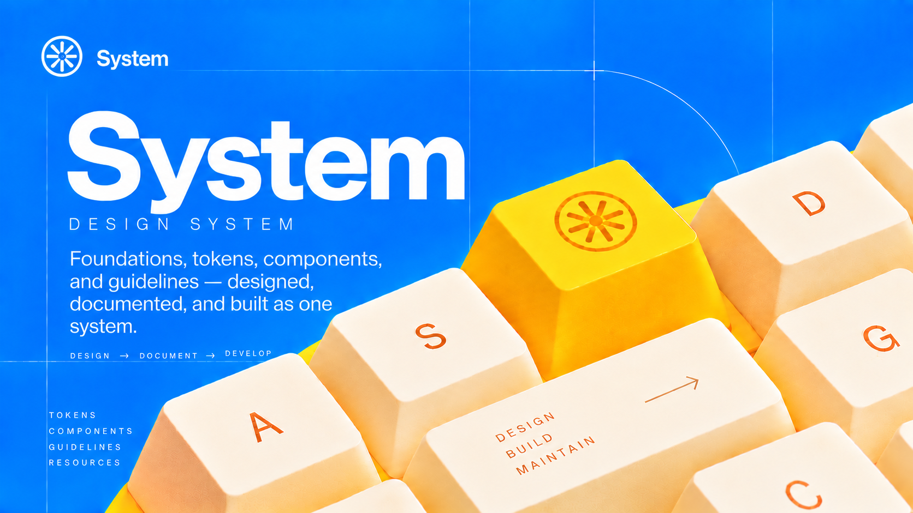

<div align="center">



**A thoughtful design system bringing tokens, foundations, and reusable components together for consistent, accessible, and scalable product experiences.**

[](https://system-three-rouge.vercel.app)
&nbsp;[](https://system-three-rouge.vercel.app)
&nbsp;[](LICENSE)

</div>

---

Distributed as a [shadcn](https://ui.shadcn.com)-compatible registry, System defines colour,
typography, icons, spacing, and elevation **once** as design tokens, then consumes them
everywhere through CSS variables — so the visual language stays consistent from design to
production, and re-theming means re-pointing tokens, not editing components.

## 🔗 Links

- **[Documentation](https://system-three-rouge.vercel.app)** — the live, browsable showcase
- **[Installation](#installation)** — add it to a React + Tailwind app
- **[Specs](docs/)** — written docs, per foundation and component

## What's inside

**Foundations** — Colour (semantic roles over 13 primitive ramps) · Typography (one Inter
scale) · Icons (Lucide, 16 → 48) · Spacing (4px base) · Elevation (shadow ladder).

**Components** — Button (`src/components/ui/button.tsx`): four variants, three sizes,
icon-only, and full interaction states (hover, focus, pressed, disabled).

## Installation

Add the Button (with its token dependencies) to any React + Tailwind app:

```bash
npx shadcn@latest add https://system-three-rouge.vercel.app/registry/button.json
```

Tokens only:

```bash
npx shadcn@latest add https://system-three-rouge.vercel.app/registry/tokens.json
```

> Not using shadcn? `@import "./src/index.css";` and use the CSS variables directly.

## Development

```bash
npm install
npm run tokens     # regenerate src/index.css + showcase data from tokens/
npm run build      # tokens → validate → generate the registry into public/registry/
npm run serve      # serve the documentation showcase locally
```

The JSON in `tokens/` is the **source of truth** — `src/index.css`, the showcase data, and the
registry items are all generated from it. Never edit them by hand.

## Project layout

```
tokens/            design tokens — the source of truth
src/
  index.css        generated CSS variables (@theme + primitive/semantic tiers)
  components/ui/    components (button.tsx)
docs/              written specs, per foundation and component
scripts/           token build + registry generation and validation
public/            documentation showcase + generated registry items
```

## License

[MIT](LICENSE)
