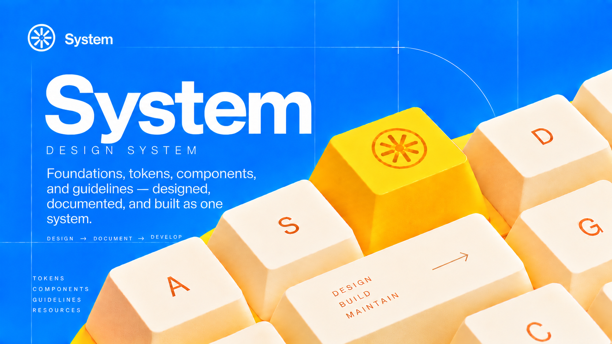

<div align="center">



**A thoughtful design system bringing tokens, foundations, and reusable components together for consistent, accessible, and scalable product experiences.**

[](https://system-three-rouge.vercel.app)
&nbsp;[](https://system-three-rouge.vercel.app)
&nbsp;[](https://main--6ac2268a62d446221f928f49.chromatic.com)
&nbsp;[](LICENSE)

</div>

---

Distributed as a [shadcn](https://ui.shadcn.com)-compatible registry, System defines colour,
typography, icons, spacing, and elevation **once** as design tokens, then consumes them
everywhere through CSS variables — so the visual language stays consistent from design to
production, and re-theming means re-pointing tokens, not editing components.

## 🔗 Links

- **[Documentation](https://system-three-rouge.vercel.app)** — the live, browsable showcase
- **[Storybook](https://main--6ac2268a62d446221f928f49.chromatic.com)** — interactive component & token workshop (on Chromatic)
- **[Installation](#installation)** — add it to a React + Tailwind app
- **[Specs](docs/)** — written docs, per foundation and component

## What's inside

**Foundations** — Colour (semantic roles over 13 primitive ramps) · Typography (one Inter
scale) · Icons (Lucide, 16 → 48) · Spacing (4px base) · Elevation (shadow ladder).

**Components** — Button (`components/button/`): four variants, three sizes, icon-only, and
full interaction states (hover, focus, pressed, disabled).

## Installation

Add the Button (with its token dependencies) to any React + Tailwind app:

```bash
npx shadcn@latest add https://system-three-rouge.vercel.app/registry/button.json
```

Tokens only:

```bash
npx shadcn@latest add https://system-three-rouge.vercel.app/registry/tokens.json
```

> Not using shadcn? `@import "./src/index.css";` and use the CSS variables directly.

## Development

```bash
npm install
npm run tokens     # regenerate src/index.css + showcase data from tokens/
npm run build      # tokens → validate → generate the registry into public/registry/
npm run serve      # serve the documentation showcase locally
```

The source is layered by responsibility: **tokens/** (JSON — values), **components/** (TSX —
implementation), **docs/** + **components/*/*.mdx** (MDX — knowledge), **schemas/** (JSON
Schema — machine-expected shape), **registry/** (JSON — the map). Generated files
(`src/index.css`, `public/`, `dist/`, `storybook-static/`) are never edited by hand.

## Storybook

An interactive workshop for developing, documenting, and visually testing components — an
**additional layer** that renders the real components and tokens from this repo. It reuses the
existing Tailwind v4 pipeline and tokens (no second token system) and does not replace the
showcase, the registry, or `npm run build`.

```bash
npm run storybook          # dev server on http://localhost:6006
npm run build-storybook    # static build → storybook-static/
npm run chromatic -- --project-token=<token>   # publish to Chromatic
```

The sidebar lists **Tokens** (Colors, Typography, Spacing, Elevation, Border as documentation
pages) first, then **Components** (Button). It's hosted on **[Chromatic](https://main--6ac2268a62d446221f928f49.chromatic.com)**,
a separate deploy from the Vercel-hosted registry — two sites, one repository. See
[`STORYBOOK.md`](STORYBOOK.md) for configuration and deployment details.

## Project layout

```
.storybook/        Storybook config (main · preview · manager) + brand assets
tokens/
  primitives/      raw values — color, spacing, typography, shadow, radius, icon (JSON)
  semantic/        roles that reference primitives — color, text, background, border, action
components/
  button/          button.tsx (impl) · button.mdx (docs) · schema.json · button.stories.tsx
foundations/       Storybook Tokens/* doc pages (MDX) + token galleries
docs/
  foundations/     one .mdx per foundation (what/why/how)
  principles/      accessibility · localization · usage
schemas/           JSON Schema for tokens, components, documentation
registry/          generated machine-readable map (components, tokens, docs, schemas)
scripts/           build-tokens · build-docs · generate-registry · validate (+ shadcn)
mcp/               reserved for a future MCP server (not implemented)
src/               registry hooks + lib, and the generated index.css
public/            the documentation showcase + generated shadcn registry
```

## License

[MIT](LICENSE)
